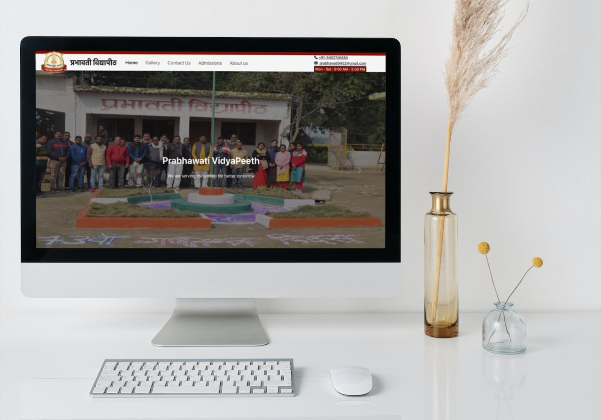

# [Prabhawati VidyaPeeth](https://prabhawatividyapeeth.in/)


### Welcome to our School Website!

Our mission is to provide our students, staff, and parents with the resources they need to achieve their academic and personal goals.
The main Objective of our school is to provide a quality education that prepares all students for success in college and in the workforce.

We are committed to creating a safe and supportive environment where all students can learn and succeed.
We are proud of our strong traditions and values, and we work hard to promote a positive school culture.

We hope you will visit our website often and find the information you need to support your academic and personal success.


<div align="center">
    
</div>

<br />

# [प्रभावती विद्यापीठ](https://prabhawatividyapeeth.in/)


## Dev Branch : [https://sineshx.com/PrabhawatiVidyaPeeth/](https://prabhawatividyapeeth.in/) 

# How to contribute : 


## Steps to Setup this Repository Locally 💻

  1. Fork this repository to your account.


  2. Go to Git Bash and Clone the forked repository using :
       
       a. Clone the repository
```bash
   git clone https://github.com/your_username/make-pull-request
```


 3. Open the folder in your favourite code editor and add your changes or modifications.
 
## Creating a PR 
 
 1. After making changes or modification on to your code locally, you need to add these files to the staging area.
```bash
  git add <file-name>
```
 2. Once files added, you need to commit the changes to with an appropriate commit message.
```bash
  git commit -m "<your-message>"
```
 3. After commiting the changes, you need to push the changes
```bash
   git push origin <branch-name>
```
 4. Once you push the changes to your repository, the Compare & pull request button will appear in GitHub.

 5. Click it and you'll be taken to this screen

 6. Type a proper description and give the PR an appropriate title. Finally, Open a pull request by clicking the Create pull request button.

 7. That's it. You have opened a PR. Wait for it to get merged.

## For a valid Pull Request (PR) 🚀:
 - Create an issue and describe it properly. 🧭 
 - While creating PR, make sure you have mentioned the issue which you have solved. 📝 

😇  Even if you can improve the documentation or fix typo, you are welcome.

Thank You!

Happy Open Sourcing :)

## Thank You for your Amazing Contribution!!
=======
Happy Open Sourcing :)


# About the website :
## It is a High School website, live @ [PrabhawatiVidyaPeeth.in](https://prabhawatividyapeeth.in/)
### Currently it is a static website , further we will improve :).

